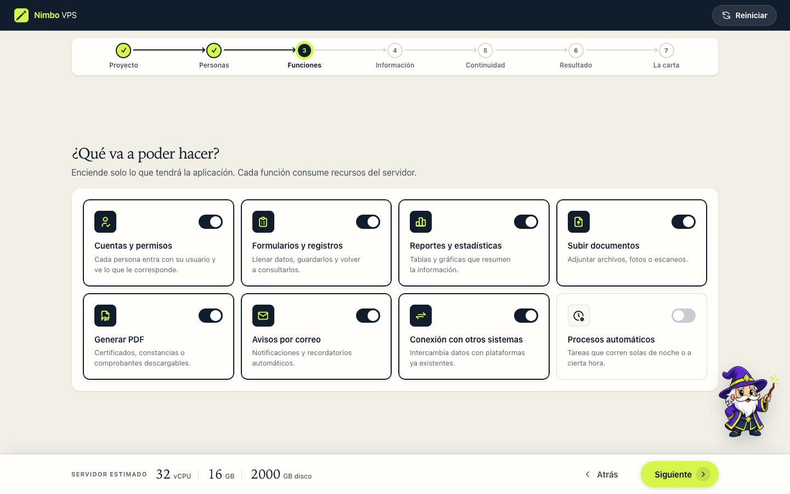
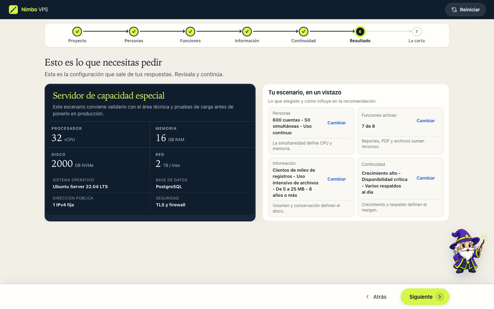

<p align="center">
  
</p>

<h1 align="center">Nimbo VPS</h1>

<p align="center">
  Una calculadora encantada que convierte necesidades de negocio en una solicitud clara de infraestructura VPS.
</p>

<p align="center">
  <a href="https://github.com/juandiegoc30/vps-calculator/actions/workflows/ci.yml"></a>
  <a href="https://github.com/juandiegoc30/vps-calculator/actions/workflows/deploy-pages.yml"></a>
  <a href="LICENSE"></a>
</p>

Nimbo VPS guía a personas no técnicas por un cuestionario breve sobre usuarios, funciones, datos y continuidad. Con esas respuestas estima CPU, memoria, disco y transferencia, explica la recomendación y redacta una carta lista para el área de infraestructura.

**Demo:** [juandiegoc30.github.io/vps-calculator](https://juandiegoc30.github.io/vps-calculator/)


## Qué resuelve

- Formula preguntas en lenguaje cotidiano, sin exigir conocimientos de servidores.
- Mantiene visible una estimación de recursos durante el recorrido.
- Organiza el proceso en siete etapas y doce pantallas enfocadas.
- Explica cómo cada respuesta influye en la recomendación.
- Compara un escenario mínimo, el recomendado y otro preparado para crecer.
- Genera una solicitud formal que se puede copiar, imprimir o guardar como PDF conservando su formato visual.
- Cierra el flujo de forma explícita: después de finalizar, el formulario queda bloqueado y solo una recarga inicia una solicitud nueva.
- Incluye a Nimbo, un asistente animado con consejos diferidos que respeta `prefers-reduced-motion`.
- No envía ni persiste respuestas: todo el cálculo ocurre localmente en el navegador.

## Recorrido

| Funciones | Resultado | Solicitud finalizada |
| --- | --- | --- |
|  |  |  |

## Tecnología

- HTML5 semántico.
- CSS propio y responsive, sin framework.
- JavaScript Vanilla.
- [Tabler Icons](https://tabler.io/icons), empaquetado localmente.
- Playwright para pruebas de layout, interacción y regresión visual básica.
- GitHub Actions y GitHub Pages para CI/CD.

No hay backend, cookies, telemetría ni dependencias de ejecución. Playwright solo se instala en desarrollo y CI.

## Inicio rápido

Requisitos: Node.js 22 o posterior.

```bash
git clone https://github.com/juandiegoc30/vps-calculator.git
cd vps-calculator
npm ci
npx playwright install chromium
npm run ci
```

Para navegar el sitio localmente:

```bash
python3 -m http.server 8080
```

Abre `http://localhost:8080/` para la landing o `http://localhost:8080/app.html` para la calculadora.

## Comandos

| Comando | Propósito |
| --- | --- |
| `npm run test:smoke` | Valida cálculo, carta, presets, iconos, navegación y cierre sin abrir un navegador. |
| `npm run test:layout` | Recorre la interfaz en diez viewports y verifica layout, accesibilidad operativa, Nimbo, impresión y estado terminal. |
| `npm test` | Ejecuta ambas suites. |
| `npm run build` | Genera `dist/` con solo los archivos necesarios para producción. |
| `npm run ci` | Ejecuta sintaxis, pruebas y build, igual que GitHub Actions. |
| `npm run screenshots` | Regenera las capturas usadas por este README. |

## Estructura

```text
.
├── index.html                    landing
├── app.html                      calculadora y carta
├── assets/
│   ├── brand/                    marca maestra y variantes
│   ├── css/styles.css            sistema visual compartido
│   ├── images/                   poses fuente y animaciones de Nimbo
│   ├── js/app.js                 cálculo e interacción del wizard
│   ├── js/landing.js             comportamiento de la landing
│   └── vendor/tabler-icons/      iconos locales y licencia
├── docs/                         arquitectura, método, pruebas y despliegue
├── scripts/                      build, capturas y generación de recursos
├── tests/                        pruebas de humo y layout
└── .github/workflows/            integración y despliegue continuo
```

La landing y la aplicación comparten estilos y marca, pero mantienen responsabilidades distintas. Consulta [Arquitectura](docs/arquitectura.md) para conocer el flujo de datos y las decisiones técnicas.

## Documentación

- [Metodología de cálculo](docs/metodologia.md)
- [Arquitectura técnica](docs/arquitectura.md)
- [Pruebas y control de calidad](docs/pruebas.md)
- [Despliegue y operación](docs/despliegue.md)
- [Accesibilidad y privacidad](docs/accesibilidad-y-privacidad.md)
- [Cómo contribuir](CONTRIBUTING.md)
- [Política de seguridad](SECURITY.md)
- [Historial de cambios](CHANGELOG.md)

## Alcance de la estimación

La salida es un punto de partida para levantar requerimientos, no una garantía de rendimiento. Antes de producción, el equipo técnico debe validar la configuración con pruebas de carga, observabilidad y datos representativos. Los supuestos están documentados en la [metodología](docs/metodologia.md).

## Licencia

Copyright © 2026 Juan Diego Castellanos. Este proyecto se publica bajo la [licencia MIT](LICENSE). Los componentes de terceros se detallan en [THIRD_PARTY_NOTICES.md](THIRD_PARTY_NOTICES.md).
